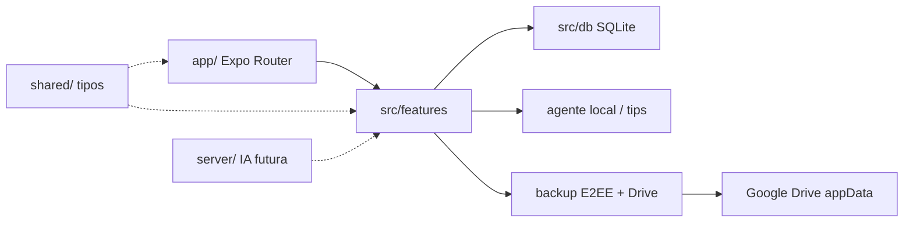

# PRD — Capim

**Versão:** 0.2.0  
**Status:** em curso (MVP)  
**Última atualização:** 2026-08-05

> Product Requirement Document. Fonte da verdade do **produto atual**.  
> Backlog futuro: `docs/melhorias-futuras.md` (arquivo local — não versionado no fork DIO).

## 1. Problema e usuário

- **Problema:** Apps de finanças pedem muita digitação em formulários; a pessoa desiste de registrar gastos. Perda do aparelho sem backup apaga o histórico.
- **Usuário:** Pessoa física que quer organizar o mês sem planilha — iniciantes e quem já desistiu de apps “pesados”.
- **Contexto:** Uso diário no celular (Android/iOS), preferência por falar o gasto em linguagem natural; dados sensíveis no aparelho + backup opcional E2EE no Google Drive do usuário.

## 2. Objetivo

- **Objetivo principal:** Registrar receitas/despesas por chat, categorizar, ver saldo do mês, metas e dicas do agente — offline-first — com backup criptografado automático no Drive.
- **Sucesso:** Em menos de 30s o usuário registra “gastei 45 no mercado” e vê o lançamento no mês; com sync ativo, o snapshot sobe criptografado após mudanças.

### Fora de escopo (agora)

Ver `docs/melhorias-futuras.md`: Open Banking, IA via API paga, compartilhamento familiar, merge fino multi-device, web dashboard.

## 3. Arquitetura (resumo)



| Camada | Pasta | Papel |
|--------|-------|--------|
| UI | `app/` | Tabs: Início, Chat, Lançamentos, Metas, Investir, Backup |
| Features | `src/features/` | Parser de chat, agente, auth local, backup/sync |
| Dados | `src/db/` | SQLite `capim.db` (centavos) |
| Contratos | `shared/` | Tipos TypeScript |
| API | `server/` | Stub — chaves só em `.env` |

**Regras:** UI → features → dados; senha/biometria local (Secure Store); snapshot Drive só com ciphertext (AES-GCM); sem secrets no client além de Client IDs OAuth públicos.

## 4. Requisitos funcionais

| ID | Requisito | Prioridade | Status |
|----|-----------|------------|--------|
| RF-01 | Lock local (senha + biometria opcional) | Must | Feito |
| RF-02 | Chat em pt-BR registra receita/despesa com valor | Must | Feito |
| RF-03 | Categorização automática por heurísticas | Must | Feito |
| RF-04 | Lista de lançamentos | Must | Feito |
| RF-05 | Resumo do mês (entradas, saídas, saldo) | Must | Feito |
| RF-06 | Metas com progresso | Must | Feito |
| RF-07 | Dicas do agente a partir do resumo/metas | Should | Feito |
| RF-08 | Comando “resumo” / “ajuda” no chat | Should | Feito |
| RF-09 | Conectar Google Drive (OAuth, scope appData) | Must | Feito |
| RF-10 | Backup E2EE (DEK/KEK + AES-GCM) no Drive | Must | Feito |
| RF-11 | Sync automático (debounce + foreground) | Must | Feito |
| RF-12 | Restaurar snapshot do Drive (confirmação destrutiva) | Must | Feito |
| RF-13 | Gráfico de pizza dos gastos por categoria (Início) | Should | Feito |
| RF-14 | Carteira de investimentos (aportes/resgates, chat + aba) | Must | Feito |
| RF-15 | Excluir lançamentos, metas e investimentos (com confirmação) | Must | Feito |
| RF-16 | Editar categoria de lançamentos | Must | Feito |
| RF-17 | Filtro por mês (Início e Lançamentos) | Must | Feito |
| RF-18 | Orçamento mensal por categoria + alertas | Must | Feito |

## 5. Requisitos não-funcionais

| ID | Tema | Requisito |
|----|------|-----------|
| RNF-01 | Confidencialidade | Dados no device; senha hasheada; blob Drive criptografado; sem PII/tokens em logs |
| RNF-02 | Integridade | Valores em centavos; SQL prepared statements; restore valida versão do blob |
| RNF-03 | Disponibilidade | Offline-first; sync enfileira dirty e sobe quando online |
| RNF-04 | UX | App nativo Expo; tipografia Fraunces + DM Sans; pt-BR |

## 6. Critérios de aceite

- [x] Happy path: chat “gastei 45 no mercado” → lançamento + saldo
- [x] Edge: mensagem sem valor → resposta pedindo clarificação
- [x] Lock local no primeiro uso
- [x] Com Client IDs configurados: conectar Drive → ativar sync com senha → arquivo `capim-backup.v1.json` na appData
- [x] Restaurar com senha correta; senha errada falha sem corromper dados locais até confirmar
- [x] `npm run typecheck` / `db:check` / `cid:check` passando
- [x] Sem secrets no repo

## 7. Prompt final (PRD para IA / entrega DIO)

```txt
# Contexto
Quero criar o Capim, app nativo (Expo/React Native) de Organização de Finanças Pessoais
que funciona por conversa. Offline-first com SQLite, arquitetura em camadas como meu app GEMA
(app/ rotas, src/features, src/db, shared/, server/ opcional para IA).

# Problema
Apps atuais exigem muita entrada manual. Quero registrar gastos falando:
"gastei 45 no mercado", com categorização automática e dicas de economia.
Também preciso de backup criptografado no meu Google Drive com sync automático.

# Público-Alvo
Iniciantes em organização financeira no Brasil (pt-BR, BRL).

# Funcionalidades-Chave (MVP)
1. Lock local (senha/biometria) — dados sensíveis no aparelho.
2. Registrar gastos/receitas via chat em linguagem natural.
3. Classificar automaticamente as transações (categorias em pt-BR).
4. Definir e acompanhar metas financeiras.
5. Dashboard do mês + dicas do Agente Capim (regras locais no MVP; API depois).
6. Valores em centavos; sem float para dinheiro.
7. Backup E2EE no Google Drive (appData) + sync automático.

# Entregável
App Expo funcional + README com este PRD, prints e reflexão do processo Vibe Coding.
Tom educativo, linguagem acessível, em português.
```

## 8. Histórico breve

| Data | Mudança |
|------|---------|
| 2026-08-05 | PRD inicial + scaffold MVP Expo |
| 2026-08-05 | RF-09..12 backup Drive E2EE + sync auto |
